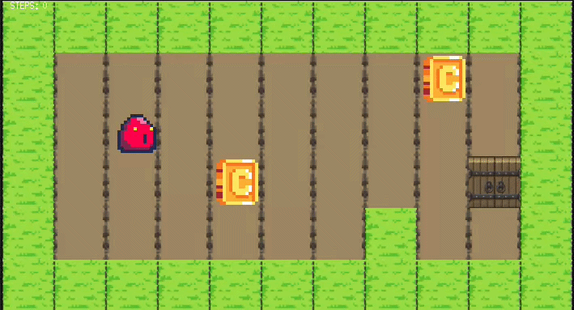

# so_long - 42 Lisboa 🎮

A small 2D game designed to improve skills in graphics, window management, and event handling using the **MiniLibX** library.

## 📝 Description
**so_long** is a project at **42 Lisboa** that challenges students to create a simple graphical game. The goal is for the player to collect all items on a map and reach the exit with the minimum number of movements possible.

## 📸 Preview
<p align="center">
  
</p>

## 🚀 Key Features
- **Graphic Management:** Using MiniLibX to render sprites and manage windows.
- **Event Handling:** Capturing keyboard inputs (WASD/Arrows) and window close events.
- **Map Parsing:** Reading and validating `.ber` files to ensure they follow specific rules.
- **Movement Counter:** Real-time display of the number of steps taken in the terminal.

## 🛠️ Technologies
- **Language:** C
- **Graphics Library:** MiniLibX (Linux)
- **Concepts:** Memory management, 2D arrays, and the Flood Fill algorithm.

## ⚙️ Compilation & Usage

### 1. Clone the MiniLibX
Before compiling, you need to clone the graphical library into your project directory (replace `$(MLX_DIR)` with the name of your MLX folder, usually `minilibx-linux`):
```bash
git clone [https://github.com/42paris/minilibx-linux.git](https://github.com/42paris/minilibx-linux.git) $(MLX_DIR)
```

### 2. Build the project
To compile the game, run the following command in your terminal:
```bash
make
```

### 3. Run the Game
Execute the program by providing a valid map file as an argument:
```bash
./so_long correct.ber
```

## 🗺️ Map Rules
The game only accepts maps with the `.ber` extension:
- `1` for Walls
- `0` for Empty Space
- `P` for the Player's starting position
- `C` for Collectibles
- `E` for the Map Exit

---
*Developed as part of my Software Engineering journey at **42 Lisboa** (April 2025 intake).*
